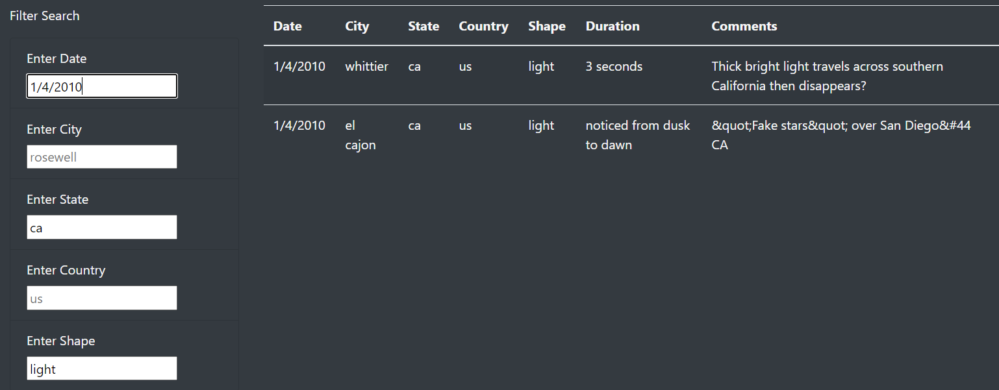

# UFOs

## Project Overview  
Build a webpage and dynamic table that will display a list of UFO sightings. Users may input criteria on searches to filter the data being displayed such as date, city, state, country, and shape.

## Filtering Table Results  
In the filter search column, users may enter a value into a filter and the function will combine the filters and return the results matching the criteria. Placeholders have been shown on the inputs for examples of what is needed for the filter. Not all filters are needed to perform a search.  
  
For example, entering in a date of 1/4/2010, ca for state, light for shape and leaving city and country empty will return two rows of data matching this criteria.  
  

## Summary  
The webpage functions well with the data given. However, this data is static and would not have any new data introduced unless the page can pull infomation from another source that is regularly updated.  
Another recommendation for further development is to have a function for the user to extract the data onto a spreadsheet. This would provide added benifit for user research and reporting. Also, the page could implement a news article section that shows the latest UFO sighting.  